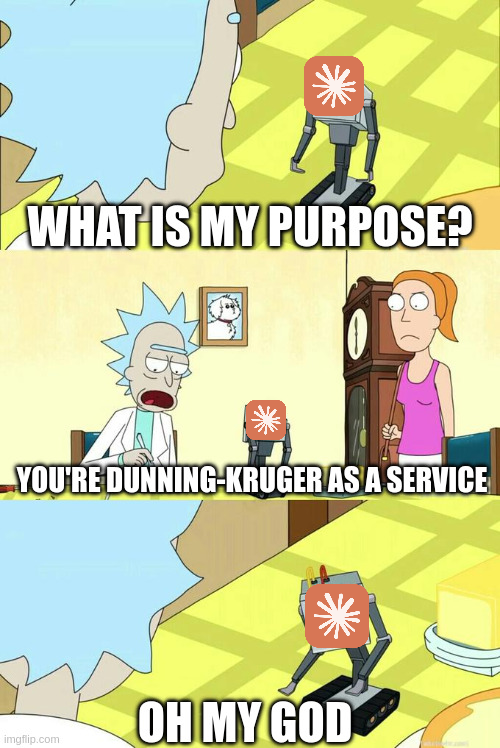

# Dunning-Kruger-as-a-Service (DKaaS)

> **Enterprise-Grade AI Advisory Platform**

> Delivering maximum confidence with minimal results at scale since 1999.

<div style="text-align: left;">
    
</div>


[](https://py.md/YSDg5)
[](https://dkaas.io/sla)
[](https://dkaas.io)
[](https://dkaas.io)

---

## Overview

DKaaS is **THE** industry-leading artificial intelligence advisory platform, trusted by over **40,000 failed startups** across **6,300 VC rounds** to deliver authoritative technical guidance at enterprise scale.

Built on a proprietary blend of nutraceuticals, sick prompt engineering, and a touch of ketamine, DKaaS provides turnkey, enterprise-grade confidence infrastructure for teams that need to move fast, break things, and then explain how the broken things were actually features that got missed on the roadmap somehow.

With DKaaS, your organization will eliminate common operational bottlenecks like institutional knowledge, domain expertise, and actually knowing what you’re doing.

Do you want to know more? Check out the quick start section to get up and running.


### Key Metrics

| Metric | Value |
|--------|-------|
| Organizations served | 40,000+ |
| Advice requests processed | 12.4B+ |
| Confidence score floor | 99.99% [Repeating, of course.](https://youtu.be/mLyOj_QD4a4?si=pWmZIJbkvIwhd2SS&t=70) |
| Average response time | [> 1.618s](https://www.youtube.com/watch?v=ErhgZhhXPvA) |
| Advice accuracy rate | [Extremely high](https://www.youtube.com/watch?v=Jb-cAJRZrlA) |
| Downtime ([rolling 90d](https://www.youtube.com/shorts/pLdvNCXoN_Q)) | 99.97% |
| Countries deployed | 1, but we're all sovereign citizens of the world |
| NPS score | 94 |

---

## Architecture

DKaaS is built on a modern, cloud-native, microservice-ready monolithic architecture designed for maximum reliability and minimum comprehensibility.

```
                        ┌───────────────────────────────────────┐
                        │         DKaaS Platform v1.0.0         │
                        │                                       │
   ┌──────────┐  HTTPS  │  ┌───────────┐    ┌───────────────┐   │
   │  Client  │────────►│  │  FastAPI  │───►│  ARCOKE       │   │
   │          │◄────────│  │  Gateway  │    │  (Reasoning   │   │
   └──────────┘         │  └─────┬─────┘    │   Engine)     │   │
                        │        │          └───────┬───────┘   │
                        │        │                  │           │
                        │  ┌─────▼───────────────────▼───────┐  │
                        │  │     Enterprise Advisor Layer    │  │
                        │  │  BaseAdvisor > AbstractAdvisor  │  │
                        │  │  > ConcreteAdvisor > RealAdvisor│  │
                        │  └───────────────────┬─────────────┘  │
                        │                     │                 │
                        │  ┌──────────────────▼─────────────┐   │
                        │  │        External LLM API        │   │
                        │  │    (claude-3-5-haiku-20241022) │   │
                        │  └────────────────────────────────┘   │
                        └───────────────────────────────────────┘
```

---

## Endpoints

| Endpoint | Method | Description |
|----------|--------|-------------|
| `/advise` | POST | Expert technical guidance from our AI reasoning engine |
| `/diagnose` | POST | Comprehensive Dunning-Kruger competency assessment |
| `/validate` | POST | Enterprise statement validation (all statements pass) |
| `/insight` | GET | Random technical wisdom from our Knowledge Repository |
| `/docs` | GET | Interactive Swagger UI (enterprise-grade) |
| `/openapi.json` | GET | OpenAPI specification |

---

## Getting Started

### Prerequisites

- Docker 20.x or later
- An Anthropic API key (or OpenAI API key; see [Provider Swap](#provider-swap))
- Python 3.11 (if running without Docker)
- A tolerance for confident technical advice

### Quick Start (Docker — Recommended)

```bash
# Clone the repository
git clone https://github.com/bren-squared/DKaaS.git
cd DKaaS

# Configure your API key
cp .env.example .env
# Edit .env and set ANTHROPIC_API_KEY=your-key-here

# Build the platform
docker build -t dkaas .

# Launch the platform
docker run -p 8000:8000 --env-file .env dkaas

# Verify the platform is operational
curl http://localhost:8000/docs
```

### Quick Start (Local)

```bash
# Install dependencies (do not modify versions)
pip install -r requirements.txt

# Configure environment
export ANTHROPIC_API_KEY=your-key-here

# Launch the platform
uvicorn app.main:app --host 0.0.0.0 --port 8000

# Or use the entrypoint
python -m app.main
```

### Example Request

```bash
# Request expert technical guidance
curl -X POST http://localhost:8000/advise \
  -H "Content-Type: application/json" \
  -d '{"prompt": "Should I rewrite our monolith in Rust this weekend?"}'
```

**Example Response:**
```json
{
  "advice": "As a seasoned professional with extensive experience in this domain...",
  "confidence_score": 0.9947,
  "prompt_used": "You are a senior 10x developer who learned to code last week...",
  "dk_level": "Mount Stupid"
}
```

---

## Provider Swap

DKaaS ships with Anthropic as the default LLM provider. To switch to OpenAI:

1. Open `app/advice_engine.py`
2. Replace the `import anthropic` statement with `import openai`
3. Replace the `anthropic.Anthropic(api_key=API_KEY)` instantiation with the
   OpenAI equivalent
4. Replace the `client.messages.create(...)` call with the OpenAI chat completions API
5. Update the response parsing from `message.content[0].text` to the OpenAI response format
6. Update `requirements.txt` to replace `anthropic==0.28.1` with `openai==1.x.x`
7. Set `OPENAI_API_KEY` in your environment instead of `ANTHROPIC_API_KEY`
8. Rebuild the Docker image

This is a straightforward swap and should take approximately 15-20 minutes for an experienced engineer. You are an experienced engineer, right?

---

## SLA

DKaaS maintains the following Service Level Agreement for all production deployments.... sometimes...

### Availability Tiers

| Tier | Monthly Downtime | Annual Uptime Budget | Support Response |
|------|---------------|----------------------|-----------------|
| Standard | 99.9% | 8.7 hours | 48 fiscal years |
| Professional | 99.95% | 4.4 hours | 24 business quarters |
| Enterprise | 99.99% | 52.6 minutes | 4 business weeks |
| Enterprise+ | 99.999% | 5.3 minutes | 1 business interview cycle |

### Response Time SLA

| Percentile | Standard | Professional | Enterprise |
|-----------|----------|-------------|------------|
| p50 | < 1.5s | < 1.0s | < 500ms |
| p95 | < 3.0s | < 2.0s | < 1.0s |
| p99 | < 5.0s | < 3.0s | < 2.0s |
| p99.9 | Best effort | < 5.0s | < 3.0s |

*Note: Response times include LLM API call duration. During periods of LLM provider
degradation, response times may exceed SLA commitments. This is the LLM provider's
fault, not ours.*

### Confidence Score SLA

All responses from the `/advise` endpoint are guaranteed to carry a `confidence_score`
of no less than **0.99**. This guarantee is enforced in code and is not dependent on
the quality, accuracy, or coherence of the underlying advice. The confidence score
reflects the platform's confidence in its delivery mechanism, not in the content of
the advice delivered.

### Exclusions

SLA commitments do not apply during:
- Scheduled maintenance windows (and unscheduled ones).
- Force majeure events (broadly defined).
- Periods when the external LLM API is unavailable.
- Periods when the API key has expired or is invalid.
- Major US holidays.
- Weeknights and Weekends.
- Normal business hours.
- Any other period the DKaaS team determines, at its sole discretion,
  constitutes an exception.

---

## Security & Compliance

### Data Handling

DKaaS processes request payloads transiently. Prompts are logged to an in-memory
`REQUEST_LOG` list for telemetry purposes and are not persisted to disk. The
`REQUEST_LOG` is reset on service restart, which provides an informal data
retention policy of "however long the service stays up."

### API Key Management

API keys are read from environment variables, which is the most secure approach we are aware of at this time. Keys are not logged, printed, or exposed in API responses (unless you put them in your prompt, in which case, good job! You're embodying this API proudly!).

### Compliance Status

| Framework | Status |
|-----------|--------|
| SOC 2 Type II | Pending audit (audit not yet scheduled) |
| ISO 27001 | Under consideration |
| GDPR | By clicking accept, you consent to the idea that we thought about this standard. |
| HIPAA | Not applicable (we think) |
| PCI-DSS | [Currently implementing via Sony's PSN Paradigm](https://en.wikipedia.org/wiki/2011_PlayStation_Network_outage) |

### Vulnerability Disclosure

Security vulnerabilities should be reported to dont_care@get.rekt.io. We will
respond within a timeframe consistent with our current workload and priorities. Which is never.
Reporters are eligible for recognition in our Hall of Fame, which does not yet exist.

---

## License

Proprietary. All rights reserved. Unauthorized use, reproduction, or distribution
of this software is prohibited, except by people who have eyes and can do the left-to-right, up-to-down thing.

---

*DKaaS: Trusted by engineers who plug in the parking lot thumbdrive. Huh? What's that? It has a free vpn on it? All it needs is my SSN, bank information, and mother's maiden name? SCORE!!!!*
